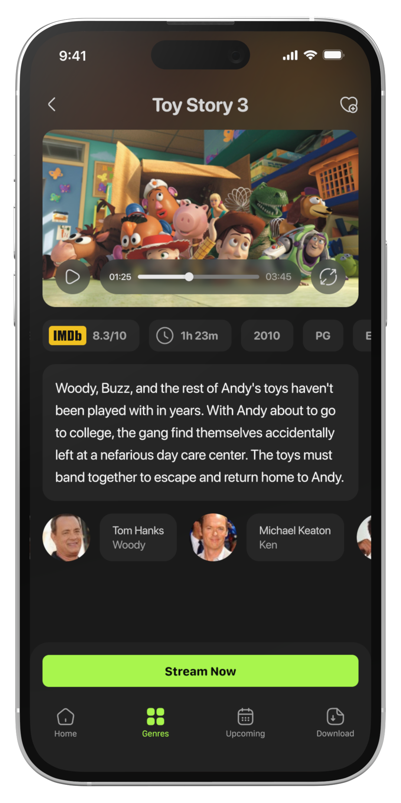
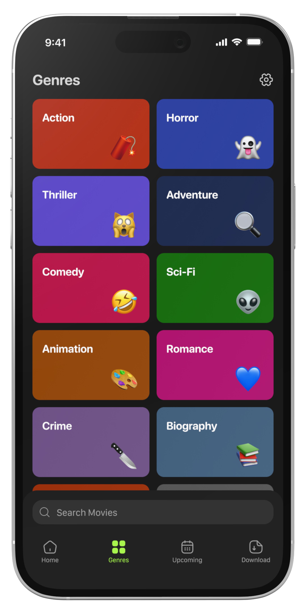
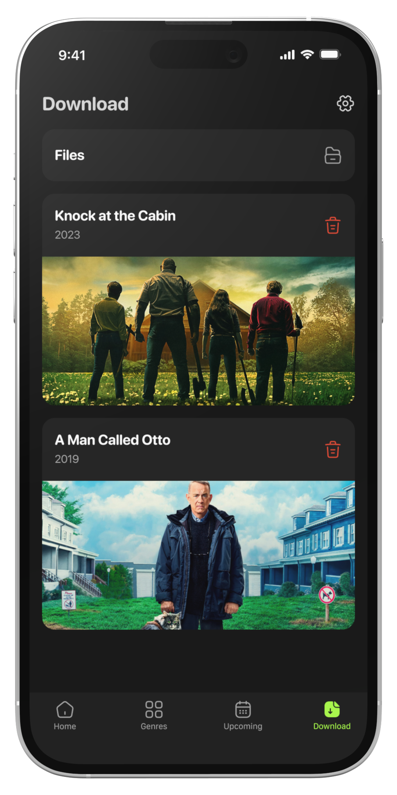
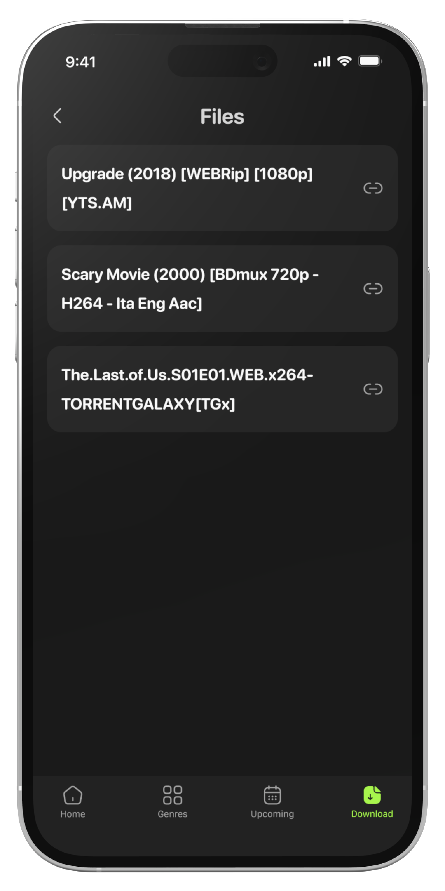
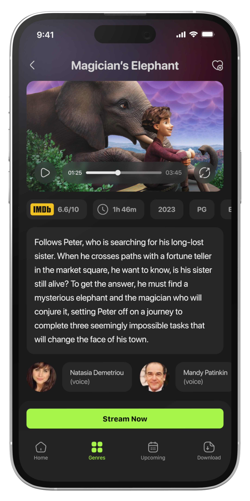
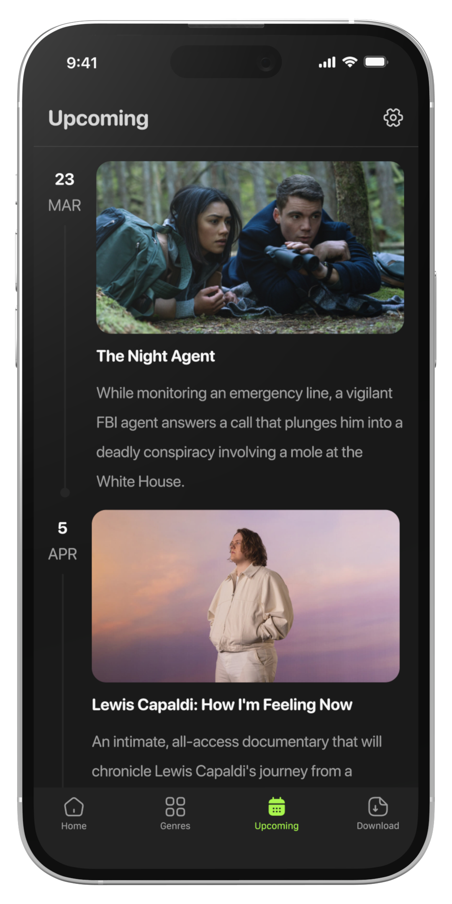

# Sonix
A [Put.io](https://put.io/) client which allows torrent trasnfers & browsing of content from the [YTS](https://yts.torrentbay.to/) API. 

# Install with TestFlight
https://testflight.apple.com/join/QyweKzw0

# Want to contribute?
Sonix is built using Swift + SwiftUI, all contributions are welcome this is a side project and i'm no Swift expert!

[Get Started](CONTRIBUTING.md)

# Screenshots

Some of these screenshots are designs and are not fully implemented yet.

