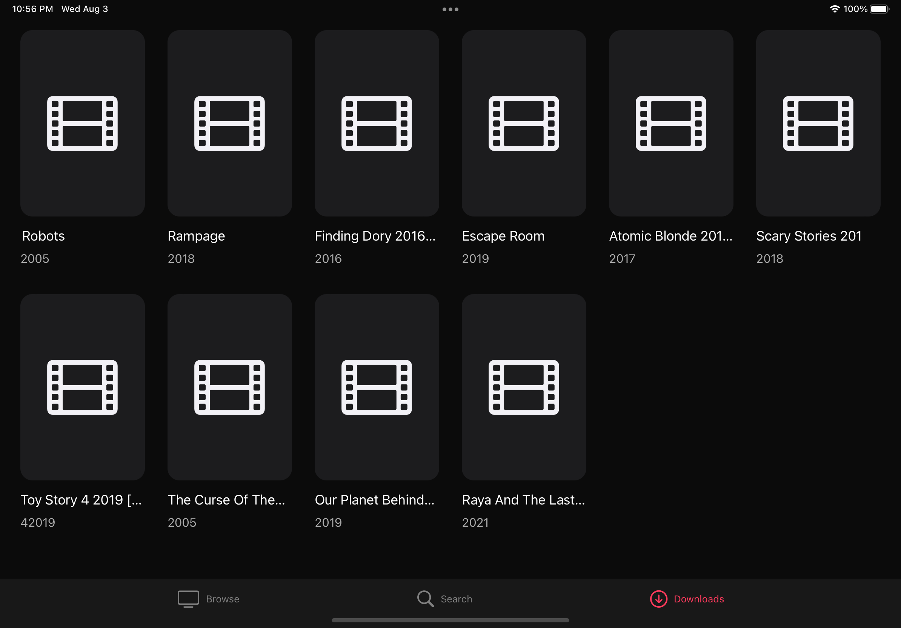

# Sonix
A [Put.io](https://put.io/) client which allows torrent trasnfers & browsing of content from the [YTS](https://yts.torrentbay.to/) API. 

# Want to contribute?
Sonix is built using Swift + SwiftUI, all contributions are welcome!

[Get Started](CONTRIBUTING.md)

# Screenshots

